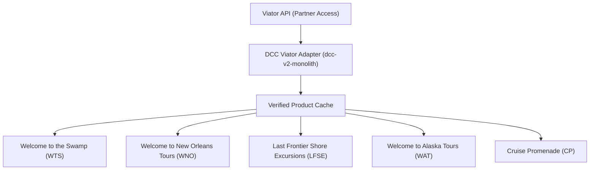

# DCC Shared Viator Integration Layer & Multi-Site Operating Architecture

**Version:** 1.0  
**Status:** Active Production Standard  
**Governing Core:** `dcc-v2-monolith`  
**Date:** September 2026  

---

## Executive Architecture Summary

Instead of every DCC satellite website connecting directly to Viator independently, the portfolio uses a single controlled **DCC Viator Adapter** hosted in `dcc-v2-monolith`. The adapter communicates with Viator’s Partner API, caches verified product intelligence, enforces portfolio-wide commercial and safety rules, and distributes normalized information to customer-facing properties.



---

## 1. Viator API

The Viator Partner API is the external marketplace source of tour and excursion inventory. It provides:
- Product titles, descriptions, and categories
- Viator product codes and booking option codes
- Supplier identity and cancellation policies
- Worldwide destination definitions (3,394 locations)
- Image and media asset references
- Dynamic retail and net pricing
- Operating schedules, blackout dates, and seasonal cutoffs
- Date-specific, option-specific availability and remaining capacities
- Traveler categories (Adult, Child, Infant) and age bands
- Aggregated ratings and review volume distributions

### Security Rule
The 36-character `VIATOR_API_KEY` remains strictly private and is configured only within the server-side runtime of `dcc-v2-monolith`. It is **never** bundled into browser JavaScript, public page source, or client-side environment variables (`NEXT_PUBLIC_*`).

---

## 2. DCC Viator Adapter

The DCC Viator Adapter (`lib/dcc/internal/dccViatorAdapter.ts`) is the translation and governance layer between Viator and the DCC websites. It understands both sides:
1. Viator’s external API structure and data schema.
2. Each satellite site’s internal product naming and editorial structure.

### Identity Mapping
The adapter bridges external codes to internal slugs:
- Viator `3780SWAMP` $\longleftrightarrow$ WTS `covered-boat-swamp-tour`
- Viator `3780AIRBOAT` $\longleftrightarrow$ WTS `airboat-swamp-tour`
- Viator `6953SWAMPTRANS` $\longleftrightarrow$ WTS `swamp-tour-with-pickup`
- Viator `331813P1` $\longleftrightarrow$ LFSE `juneau-whale-small-group`
- Viator `6251SHOREXICEWALK` $\longleftrightarrow$ LFSE `juneau-heli-glacier-walk`

### Normalization
The adapter normalizes differences in:
- Product names and editorial titles
- Price formats and currency conversion
- Tour duration (hours vs minutes vs text)
- Pickup and transfer details
- Traveler age thresholds
- Free cancellation terms
- Destination names and port slugs
- Availability responses
- Canonical affiliate URL structures

### Business Rule Enforcement Engine
The adapter enforces non-negotiable commerce and safety rules:
1. **Status Rule**: Never display an inactive or retired product.
2. **Freshness Rule**: Never display stale cached availability as live.
3. **Pickup Rule**: Never claim hotel pickup unless verified in product attributes.
4. **Port Boundary Rule**: Never advertise a tour in a port where it does not operate.
5. **Attribution Integrity**: Never route a traveler to an incorrect product code or unverified URL.
6. **Credential Boundary**: Never expose private API keys to downstream client apps.
7. **Read-Only Guarantee**: Never call booking, payment, hold, or amendment endpoints without explicit authorization.

---

## 3. Verified Product Cache

The Verified Product Cache (`lib/viator/verified-product-cache.ts`) provides a reliable, fast, structured copy of information retrieved from Viator. It avoids repeating network API calls on every pageview, provides rate-limit protection, guarantees cross-site consistency, and ensures zero downtime during upstream transient errors.

### Four-Tier Data Separation
The cache explicitly separates data by volatility:

```text
┌─────────────────────────────────────────────────────────────┐
│ 1. STABLE PRODUCT DATA (Quarterly / Monthly Refresh)        │
│    Title, Supplier, Destination, Duration, Canonical URL    │
├─────────────────────────────────────────────────────────────┤
│ 2. SLOWLY CHANGING DATA (Weekly Refresh)                    │
│    Images, Description, Inclusions, Meeting Point, Pickup   │
├─────────────────────────────────────────────────────────────┤
│ 3. FREQUENTLY CHANGING DATA (Checked at Request-Time)       │
│    Live Availability, Starting Price, Capacities, Slots     │
├─────────────────────────────────────────────────────────────┤
│ 4. AFFILIATE & SITE METADATA                                │
│    Internal ID, Viator Code, Allowed Sites, Port, Campaign  │
└─────────────────────────────────────────────────────────────┘
```

---

## 4. Satellite Website Implementations

| Satellite Site | Target Implementation & Operational Role | Commercial Balance |
| :--- | :--- | :--- |
| **Welcome to the Swamp (WTS)** | **Immediate Priority**. Guides travelers between covered swamp boats, airboats, and hotel pickups. Routes visitors to verified Viator checkout with real-time pricing. | Uses Viator alongside FareHarbor; preserves FareHarbor/direct links when operator relationships or terms are stronger. |
| **Welcome to New Orleans Tours (WNO)** | Secondary tour inventory alongside FareHarbor. Featured on comparison guides, category landing pages, and long-tail options. | Preserves FareHarbor as primary on tour detail pages; utilizes Viator for broader marketplace comparison. |
| **Last Frontier Shore Excursions (LFSE)** | Connects verified Alaska excursions to specific ports (Juneau, Skagway, Ketchikan, Sitka, Anchorage) with ship-day context and buffer calculations. | Direct alignment between ship docking schedules and excursion departure windows. |
| **Welcome to Alaska Tours (WAT)** | Destination discovery catalog for regional Alaska land adventures (whale watching, northern lights, glaciers, family outings). | Editorial discovery layer powered by verified marketplace products. |
| **Cruise Promenade (CP)** | Contextual cruise port schedule matcher. Analyzes cruise line, ship, port, arrival/departure times, and shore hours to match excursions. | Rejects excursions that start before ship arrival or return too close to all-aboard time. |

---

## 5. Direction of Data Flow

Data flows in a strictly unidirectional, controlled path:

$$\text{Viator API} \longrightarrow \text{DCC Adapter} \longrightarrow \text{Verified Product Cache} \longrightarrow \text{Customer-Facing Sites}$$

Products are routed selectively based on destination, port, activity category, group fit, and site commercial rules:
- New Orleans swamp tours route to **WTS** and **WNO**.
- Juneau whale watching routes to **LFSE**, **WAT**, and **Cruise Promenade**.
- Caribbean port excursions route to **Cruise Promenade**.
- Direct Colorado ski shuttles route to **GoSno** (bypassing Viator).

---

## 6. Request-Time Availability

Cached data aids discovery, but live requests validate the purchase decision:

1. Traveler views an editorial guide or comparison card.
2. The site displays stable and slowly changing data from the **Verified Product Cache**.
3. Traveler selects a date or clicks "Check Availability".
4. The server dispatches a live `/availability/check` request to Viator through the DCC Adapter.
5. Viator returns live bookable options, timeslots, prices, and remaining seats.
6. The site updates the UI with live confirmation.
7. The traveler follows a tracked affiliate link to complete the transaction directly on Viator.

---

## 7. Affiliate Attribution Standards

Every outbound link is enriched with structured attribution without corrupting the canonical product path:

$$\text{https://www.viator.com/tours/}\{\text{dest}\}/\{\text{slug}\}/\text{d}\{\text{destId}\}-\{\text{code}\}?\text{pid}=\dots\&\text{mcid}=\dots\&\text{campaign}=\dots\&\text{utm\_source}=\dots$$

### Standardized Campaign Conventions
- Welcome to the Swamp: `campaign=wts-plan-airboat`, `campaign=wts-plan-covered-boat`, `campaign=wts-plan-pickup`
- Welcome to New Orleans: `campaign=wno-comparison-airboat`, `campaign=wno-guide-pickup-swamp`
- Last Frontier Shore Excursions: `campaign=last-frontier-juneau-whale-small-group`
- Cruise Promenade: `campaign=cp-juneau-whale-watch-port-day`

---

## 8. Coexistence with Direct Suppliers

Viator is one supply channel within DCC's larger commerce network. The shared integration layer coexists with:
- Direct operator contracts & FareHarbor feeds
- Rezdy reservation endpoints
- Vibe Around Town driver network
- GoSno direct transportation dispatch
- Party at Red Rocks private shuttle service
- DCC / OCTO direct enterprise inventory

---

## 9. Benefits of the Centralized Model

| Without Central DCC Adapter | With DCC Shared Integration Layer |
| :--- | :--- |
| Dispersed API keys across multiple Vercel projects | **One secure credential** isolated in `dcc-v2-monolith` |
| Duplicate API client code and diverging error handling | **One integration adapter** and normalized data contracts |
| Inconsistent product slugs and broken URLs | **One verified product mapping registry** |
| Fragile availability checks triggering rate limits | **One structured cache** with request-time validation |
| Disorganized UTM and affiliate attribution tags | **One attribution standard** with full telemetry |

---

## 10. The Long-Term DCC Strategic Role

DCC acts as the travel-commerce operating system for the entire portfolio. While satellite sites serve as specialized, editorial customer-facing brands, DCC centralizes:
- Supplier connectivity
- Product identity resolution
- Inventory normalization
- Real-time availability & scheduling
- Attribution & commission tracking
- Cross-property demand intelligence
